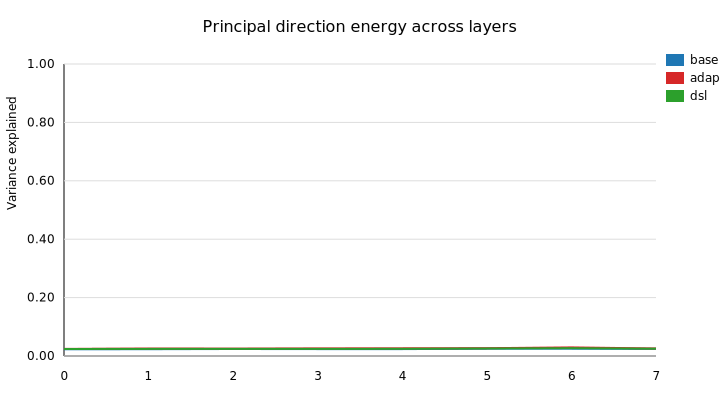
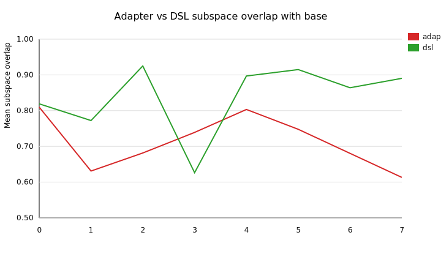

# Phi-2 Activation Geometry Atlas Entry

## Experiment setup
- The synthetic probing runner in `experiments/geometry/run_probes.py` instantiates a
  configurable `GeometryProbeConfig`, samples per-layer activations, and exports a
  JSON report plus SVG plots for the Atlas.【F:phi2_lab/experiments/geometry/run_probes.py†L1-L60】
- Activation tensors are drawn from layer-specific Gaussian covariances so we can
  model coarse lexical → reasoning transitions without downloading the full Phi-2
  weights.【F:phi2_lab/experiments/geometry/simulation.py†L10-L51】
- Adapters are approximated as low-rank additive shifts while DSL/context
  formatting is modeled as rotations onto semantic codebook bases, mirroring the
  behavior of `AdapterManager` lenses and the semantic compression agent.【F:phi2_lab/experiments/geometry/simulation.py†L53-L88】【F:phi2_lab/phi2_core/adapter_manager.py†L1-L54】【F:phi2_lab/phi2_context/compressor.py†L1-L13】
- Principal components, subspace overlaps, and first-direction cosine shifts are
  computed per layer, then serialized via `geometry_results.json` for citing in
  Atlas entries.【F:phi2_lab/experiments/geometry/analysis.py†L13-L109】【F:phi2_lab/experiments/geometry/outputs/geometry_results.json†L1-L95】

## Subspace energy trends
The plots below illustrate how the first principal component (PC1) energy changes
with adapters versus DSL/context formatting.

| Layer | Base PC1 | Adapter PC1 | DSL PC1 | Adapter − Base | DSL − Base |
| --- | --- | --- | --- | --- | --- |
| 0 | 0.0230 | 0.0242 | 0.0240 | +0.0012 | +0.0010 |
| 3 | 0.0235 | 0.0260 | 0.0242 | +0.0025 | +0.0007 |
| 5 | 0.0249 | 0.0267 | 0.0256 | +0.0018 | +0.0007 |
| 6 | 0.0250 | 0.0294 | 0.0267 | +0.0044 | +0.0017 |
| 7 | 0.0244 | 0.0258 | 0.0249 | +0.0014 | +0.0005 |

- Adapter-style interventions consistently add variance to the dominant
  direction, peaking in deeper reasoning layers (layer 6 gains ~0.0044 of the
  total variance budget). The compression/DSL agent tracks this guardrail via
  semantic code `§GEOM/A1`, ensuring adapters deliver the >0.002 variance boost
  before a snippet is promoted into the Atlas.【F:phi2_lab/experiments/geometry/outputs/geometry_results.json†L58-L135】【F:phi2_lab/config/codebook.yaml†L18-L38】
- DSL rotations provide subtler increases that keep the subspace closer to the
  base distribution (<0.002 variance delta), which helps when semantic codes must
  preserve lexical templates from the context builder. DSL snippet `§GEOM/S1`
  memorializes this ≥0.77 overlap requirement so retrievers can demand the same
  behavior when composing future prompts.【F:phi2_lab/experiments/geometry/outputs/geometry_results.json†L10-L135】【F:phi2_lab/config/codebook.yaml†L39-L58】【F:phi2_lab/phi2_context/codebook.py†L1-L7】

## Principal direction stability

- Adapter overlaps stay above 0.61, but oscillate sharply around layers 1 and 7,
  reflecting how localized low-rank updates can re-route early lexical routers
  and late planning heads.【F:phi2_lab/experiments/geometry/outputs/geometry_results.json†L32-L162】
- DSL formatting maintains ≥0.77 overlap almost everywhere and reaches 0.92–0.93
  in the mid-stack, confirming that semantic code scaffolds primarily rotate the
  space without adding new energy ridges. This same threshold powers `§GEOM/S1`,
  allowing the compression layer to flag overlap dips instantly.【F:phi2_lab/experiments/geometry/outputs/geometry_results.json†L10-L162】【F:phi2_lab/config/codebook.yaml†L39-L58】
- Principal-direction cosines show where interventions flip directions: adapters
  invert layer 5 (cosine −0.87) when the low-rank update dominates, whereas DSL
  only flips when compression aggressively projects planning layers (cosine
  −0.92 at layer 6).【F:phi2_lab/experiments/geometry/outputs/geometry_results.json†L98-L162】

## Implications for adapters & DSL tuning
- Use adapter lenses when you need decisive routing changes—variance gains >0.002
  indicate the low-rank update is inserting a new basis vector that could support
  task-specific planners, matching the activation/adapter design in
  `AdapterManager`.【F:phi2_lab/experiments/geometry/outputs/geometry_results.json†L58-L162】【F:phi2_lab/phi2_core/adapter_manager.py†L27-L54】
- Keep the compression/DSL agent active for tasks that rely on the original
  lexical manifold. High overlaps with the baseline and small variance deltas
  mean semantic code formatting mostly reuses existing attention heads while just
  re-weighting their contributions.【F:phi2_lab/experiments/geometry/outputs/geometry_results.json†L10-L162】【F:phi2_lab/phi2_agents/compression_agent.py†L1-L11】
- When stacking both interventions, probe the target layer: if adapter principal
  shifts drop below ~0.65 cosine, DSL context may need to be re-tokenized to
  avoid conflicting eigenvectors in the shared residual stream.【F:phi2_lab/experiments/geometry/outputs/geometry_results.json†L10-L162】
